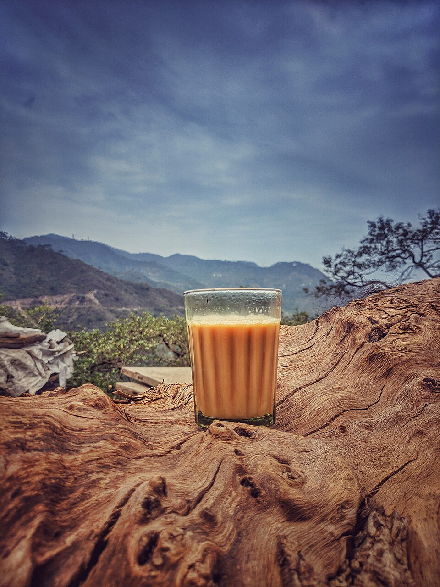
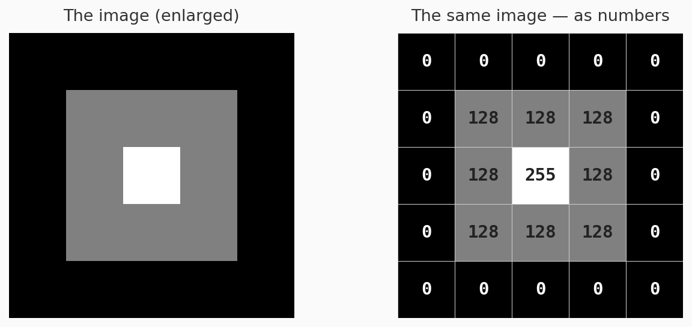
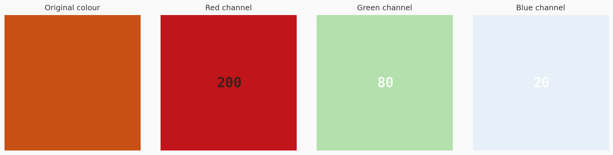
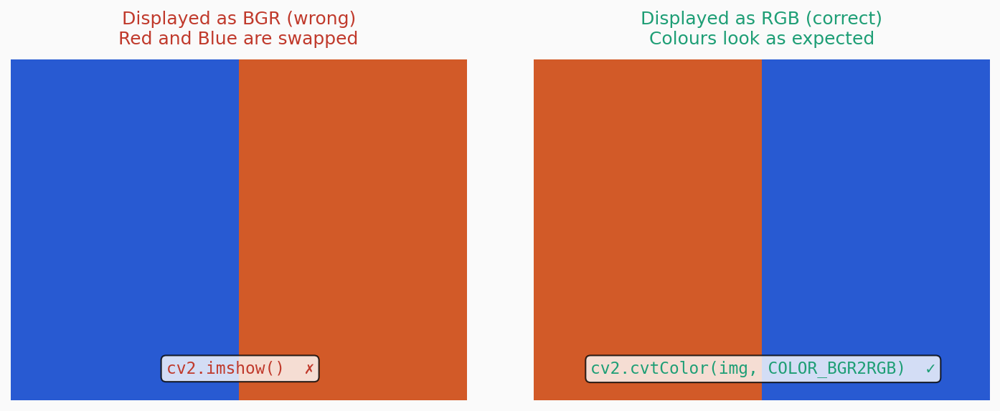

## A story first

When I got my first smartphone, I became obsessed with photography. I would click pictures of everything — chai, sunsets, my neighbour's cat. One day my younger brother asked me, *"Bhaiya, what actually is a photo? Like, what is it made of?"*

I said, *"Arrey, it is light captured on a sensor."*

He said, *"Okay but what does the phone store? It does not store light."*

I had no answer. I had been taking photos for two years and I had no idea what the phone was actually saving. I just knew it looked nice on Instagram.

Years later when I started working in computer vision I realised — most people who write OpenCV code are exactly like me that day. They know it looks nice. They have no idea what it actually is.

So let us fix that. Right now.

---

## What you see vs what the computer sees

You look at a photo and you see a mountain, a face, a cup of chai.



The computer sees none of that. It sees a **grid of numbers**. That is it. Nothing more.

Each tiny dot in that grid is called a **pixel** — short for *picture element*. And each pixel is just a number — representing how bright or what colour that dot is.

Here is the same cup of chai, shown the way a computer actually sees it — as raw numbers:

```{=html}
<div style="overflow-x:auto; margin: 1.5rem 0;">
<table style="border-collapse:collapse; font-family:monospace; font-size:13px; line-height:1.4;">
<caption style="font-size:0.85rem; opacity:0.6; margin-bottom:0.5rem; caption-side:top;">A tiny 8×8 patch from the image — each number is one pixel's brightness (0=black, 255=white)</caption>
<tbody>
<tr><td style="padding:6px 10px;background:#f5c97a;color:#333;border:1px solid rgba(0,0,0,0.08);">210</td><td style="padding:6px 10px;background:#f7c96b;color:#333;border:1px solid rgba(0,0,0,0.08);">198</td><td style="padding:6px 10px;background:#eab84d;color:#333;border:1px solid rgba(0,0,0,0.08);">174</td><td style="padding:6px 10px;background:#f2c46a;color:#333;border:1px solid rgba(0,0,0,0.08);">195</td><td style="padding:6px 10px;background:#f5c97a;color:#333;border:1px solid rgba(0,0,0,0.08);">212</td><td style="padding:6px 10px;background:#f7cc82;color:#333;border:1px solid rgba(0,0,0,0.08);">220</td><td style="padding:6px 10px;background:#f9d090;color:#333;border:1px solid rgba(0,0,0,0.08);">228</td><td style="padding:6px 10px;background:#f7cb80;color:#333;border:1px solid rgba(0,0,0,0.08);">218</td></tr>
<tr><td style="padding:6px 10px;background:#c8832a;color:#fff;border:1px solid rgba(0,0,0,0.08);">142</td><td style="padding:6px 10px;background:#d4922f;color:#fff;border:1px solid rgba(0,0,0,0.08);">158</td><td style="padding:6px 10px;background:#e8b04a;color:#333;border:1px solid rgba(0,0,0,0.08);">168</td><td style="padding:6px 10px;background:#c47828;color:#fff;border:1px solid rgba(0,0,0,0.08);">138</td><td style="padding:6px 10px;background:#b86820;color:#fff;border:1px solid rgba(0,0,0,0.08);">122</td><td style="padding:6px 10px;background:#cc8830;color:#fff;border:1px solid rgba(0,0,0,0.08);">148</td><td style="padding:6px 10px;background:#e0a840;color:#333;border:1px solid rgba(0,0,0,0.08);">162</td><td style="padding:6px 10px;background:#d89038;color:#333;border:1px solid rgba(0,0,0,0.08);">155</td></tr>
<tr><td style="padding:6px 10px;background:#8c4010;color:#fff;border:1px solid rgba(0,0,0,0.08);">82</td><td style="padding:6px 10px;background:#a05018;color:#fff;border:1px solid rgba(0,0,0,0.08);">98</td><td style="padding:6px 10px;background:#bc6c22;color:#fff;border:1px solid rgba(0,0,0,0.08);">118</td><td style="padding:6px 10px;background:#945018;color:#fff;border:1px solid rgba(0,0,0,0.08);">90</td><td style="padding:6px 10px;background:#804010;color:#fff;border:1px solid rgba(0,0,0,0.08);">76</td><td style="padding:6px 10px;background:#985818;color:#fff;border:1px solid rgba(0,0,0,0.08);">94</td><td style="padding:6px 10px;background:#b46820;color:#fff;border:1px solid rgba(0,0,0,0.08);">112</td><td style="padding:6px 10px;background:#a85c1c;color:#fff;border:1px solid rgba(0,0,0,0.08);">105</td></tr>
<tr><td style="padding:6px 10px;background:#f0c060;color:#333;border:1px solid rgba(0,0,0,0.08);">188</td><td style="padding:6px 10px;background:#f5c870;color:#333;border:1px solid rgba(0,0,0,0.08);">205</td><td style="padding:6px 10px;background:#f3c468;color:#333;border:1px solid rgba(0,0,0,0.08);">195</td><td style="padding:6px 10px;background:#eebb58;color:#333;border:1px solid rgba(0,0,0,0.08);">182</td><td style="padding:6px 10px;background:#f5c870;color:#333;border:1px solid rgba(0,0,0,0.08);">206</td><td style="padding:6px 10px;background:#f7ca78;color:#333;border:1px solid rgba(0,0,0,0.08);">215</td><td style="padding:6px 10px;background:#f9ce80;color:#333;border:1px solid rgba(0,0,0,0.08);">222</td><td style="padding:6px 10px;background:#f5c870;color:#333;border:1px solid rgba(0,0,0,0.08);">206</td></tr>
</tbody>
</table>
</div>
```

That table above — those are actual brightness values. That is what the computer is working with when it "looks" at your chai photo. No shapes. No objects. No meaning. Just numbers.

---

## Try it yourself — your image, your numbers

Upload any image and see exactly what a computer sees. The widget below takes a small patch from your image and shows you the raw pixel values.

```{=html}
<div id="pixel-explorer" style="border:1px solid rgba(0,0,0,0.1); border-radius:12px; padding:1.5rem; margin:2rem 0; background:rgba(0,0,0,0.02);">

  <div style="margin-bottom:1rem;">
    <label style="font-size:0.875rem; font-weight:500; display:block; margin-bottom:0.5rem;">Upload any image</label>
    <input type="file" id="img-upload" accept="image/*" style="font-size:0.85rem;">
  </div>

  <div id="explorer-output" style="display:none;">

    <div style="display:grid; grid-template-columns:1fr 1fr; gap:1.5rem; margin-top:1.25rem; align-items:start;">

      <div>
        <div style="font-size:0.75rem; font-weight:500; opacity:0.5; text-transform:uppercase; letter-spacing:0.08em; margin-bottom:0.5rem;">What you see</div>
        <canvas id="preview-canvas" style="width:100%; border-radius:8px; border:1px solid rgba(0,0,0,0.08);"></canvas>
        <div id="img-shape" style="font-family:monospace; font-size:0.8rem; opacity:0.6; margin-top:0.4rem;"></div>
      </div>

      <div>
        <div style="font-size:0.75rem; font-weight:500; opacity:0.5; text-transform:uppercase; letter-spacing:0.08em; margin-bottom:0.5rem;">What the computer sees — pixel values</div>
        <div id="pixel-grid" style="overflow-x:auto;"></div>
        <div style="font-size:0.75rem; opacity:0.5; margin-top:0.5rem;">Showing a 10×10 patch from the top-left corner</div>
      </div>

    </div>

    <div style="margin-top:1.25rem; padding-top:1.25rem; border-top:1px solid rgba(0,0,0,0.08);">
      <div style="font-size:0.75rem; font-weight:500; opacity:0.5; text-transform:uppercase; letter-spacing:0.08em; margin-bottom:0.75rem;">Colour channels</div>
      <div style="display:grid; grid-template-columns:repeat(3,1fr); gap:0.75rem;" id="channel-display">
      </div>
    </div>

    <div id="channel-note" style="margin-top:1rem; padding:0.75rem 1rem; background:rgba(29,158,117,0.08); border-left:3px solid #1D9E75; border-radius:0 6px 6px 0; font-size:0.85rem; line-height:1.6;">
    </div>

  </div>

  <div id="explorer-placeholder" style="text-align:center; padding:2rem 1rem; opacity:0.4; font-size:0.9rem;">
    Upload an image above to explore its pixel values
  </div>

</div>

<script>
document.getElementById('img-upload').addEventListener('change', function(e) {
  const file = e.target.files[0];
  if (!file) return;

  const reader = new FileReader();
  reader.onload = function(ev) {
    const img = new Image();
    img.onload = function() {

      const PATCH = 10;
      const PREVIEW_SIZE = 200;

      // Preview canvas
      const previewCanvas = document.getElementById('preview-canvas');
      const scale = Math.min(PREVIEW_SIZE / img.width, PREVIEW_SIZE / img.height);
      previewCanvas.width = Math.round(img.width * scale);
      previewCanvas.height = Math.round(img.height * scale);
      const pCtx = previewCanvas.getContext('2d');
      pCtx.drawImage(img, 0, 0, previewCanvas.width, previewCanvas.height);

      // Shape info
      document.getElementById('img-shape').textContent =
        'Shape: (' + img.height + ', ' + img.width + ', 3)  |  height × width × channels';

      // Extract patch pixels
      const patchCanvas = document.createElement('canvas');
      patchCanvas.width = PATCH;
      patchCanvas.height = PATCH;
      const ctx = patchCanvas.getContext('2d');
      ctx.drawImage(img, 0, 0, PATCH, PATCH);
      const data = ctx.getImageData(0, 0, PATCH, PATCH).data;

      // Build pixel grid — grayscale values
      let gridHtml = '<table style="border-collapse:collapse; font-family:monospace; font-size:11px;">';
      for (let y = 0; y < PATCH; y++) {
        gridHtml += '<tr>';
        for (let x = 0; x < PATCH; x++) {
          const idx = (y * PATCH + x) * 4;
          const r = data[idx], g = data[idx+1], b = data[idx+2];
          const gray = Math.round(0.299*r + 0.587*g + 0.114*b);
          const bg = 'rgb('+r+','+g+','+b+')';
          const textColor = gray > 128 ? '#333' : '#fff';
          gridHtml += '<td style="padding:4px 5px;background:'+bg+';color:'+textColor+
            ';border:1px solid rgba(0,0,0,0.08);">'+gray+'</td>';
        }
        gridHtml += '</tr>';
      }
      gridHtml += '</table>';
      document.getElementById('pixel-grid').innerHTML = gridHtml;

      // Channel display
      const channels = ['Red', 'Green', 'Blue'];
      const chColors = ['#E24B4A', '#639922', '#378ADD'];
      const chBg = ['#FCEBEB', '#EAF3DE', '#E6F1FB'];
      let chHtml = '';
      channels.forEach(function(ch, ci) {
        let sum = 0, count = 0;
        for (let i = 0; i < data.length; i += 4) {
          sum += data[i + ci];
          count++;
        }
        const avg = Math.round(sum / count);
        chHtml += '<div style="background:'+chBg[ci]+';border-radius:8px;padding:0.75rem;text-align:center;">';
        chHtml += '<div style="font-size:0.7rem;font-weight:500;color:'+chColors[ci]+';letter-spacing:0.08em;text-transform:uppercase;margin-bottom:0.25rem;">'+ch+'</div>';
        chHtml += '<div style="font-family:monospace;font-size:1.1rem;font-weight:500;color:'+chColors[ci]+';">'+avg+'</div>';
        chHtml += '<div style="font-size:0.7rem;opacity:0.6;margin-top:0.2rem;">avg value</div>';
        chHtml += '</div>';
      });
      document.getElementById('channel-display').innerHTML = chHtml;

      // Note
      document.getElementById('channel-note').innerHTML =
        '<strong>Notice:</strong> Your image has 3 channels — Red, Green, and Blue. ' +
        'But this is not always 3. Depending on the colour scheme, an image can have ' +
        '1 channel (Grayscale), 3 channels (RGB or BGR or HSV), or 4 channels (RGBA — ' +
        'where the 4th stores transparency). We cover all of this properly in the next post → ' +
        '<em>Why Does Color Space Matter?</em>';

      document.getElementById('explorer-output').style.display = 'block';
      document.getElementById('explorer-placeholder').style.display = 'none';
    };
    img.src = ev.target.result;
  };
  reader.readAsDataURL(file);
});
</script>
```

---

## The meaning of those numbers

In a grayscale image, each pixel is a single number between **0 and 255**.

- **0** means completely black
- **255** means completely white
- Everything in between is a shade of grey

Why 255? Because a pixel value is stored in **8 bits** (1 byte). The maximum value 8 bits can hold is 2⁸ − 1 = **255**. This is not arbitrary — it is a direct consequence of how computers store data.

```python
import numpy as np

pixel_value = np.uint8(200)
print(f"Pixel value:   {pixel_value}")
print(f"In binary:     {bin(pixel_value)}")
print(f"Max possible:  {np.iinfo(np.uint8).max}")
```

**Output:**
```
Pixel value:   200
In binary:     0b11001000
Max possible:  255
```

::: {.callout-note}
**Why does this matter?** When you normalise your image for a neural network by dividing by 255, you now know *exactly* why. You are mapping the range [0, 255] to [0.0, 1.0]. Every value becomes a fraction of the maximum possible brightness.
:::

---

## Creating and reading an image as numbers

Let us make this concrete. We will create a tiny 5×5 image entirely from scratch using just numbers — no camera, no file.

```python
import numpy as np
import matplotlib.pyplot as plt

# Create a tiny 5x5 grayscale image manually — just numbers
tiny_image = np.array([
    [  0,   0,   0,   0,   0],
    [  0, 128, 128, 128,   0],
    [  0, 128, 255, 128,   0],
    [  0, 128, 128, 128,   0],
    [  0,   0,   0,   0,   0]
], dtype=np.uint8)

print("The image IS these numbers:")
print(tiny_image)
print("\nShape:", tiny_image.shape)
```

**Output:**
```
The image IS these numbers:
[[  0   0   0   0   0]
 [  0 128 128 128   0]
 [  0 128 255 128   0]
 [  0 128 128 128   0]
 [  0   0   0   0   0]]

Shape: (5, 5)
```

```python
# Now display it — matplotlib turns those numbers into a visible image
plt.figure(figsize=(3, 3))
plt.imshow(tiny_image, cmap='gray', vmin=0, vmax=255)
plt.title("Our 5×5 image")
plt.axis('off')
plt.show()
```

**Output:**



You are looking at a dark square with a bright centre. That image does not come from a camera. It comes from the array of numbers we typed. The grid of numbers *is* the image — there is nothing else behind it.

---

## Colour images — three grids, not one

A grayscale image is one grid of numbers. A colour image is **three grids stacked together**.

Each grid is called a **channel**. The three channels in a standard colour image represent:

- **R** — how much Red is in each pixel (0 to 255)
- **G** — how much Green is in each pixel (0 to 255)
- **B** — how much Blue is in each pixel (0 to 255)

Together, RGB can represent approximately 16.7 million colours (256 × 256 × 256).

```python
import numpy as np
import matplotlib.pyplot as plt

# Create a 100x100 colour image — manually set each channel
colour_image = np.zeros((100, 100, 3), dtype=np.uint8)
colour_image[:, :, 0] = 200   # Red channel   — strong
colour_image[:, :, 1] = 80    # Green channel — medium
colour_image[:, :, 2] = 20    # Blue channel  — weak

print("Shape:", colour_image.shape)
print("Red channel — sample values:", colour_image[0, :5, 0])
print("Green channel — sample values:", colour_image[0, :5, 1])
print("Blue channel — sample values:", colour_image[0, :5, 2])
```

**Output:**
```
Shape: (100, 100, 3)
Red channel — sample values:   [200 200 200 200 200]
Green channel — sample values: [ 80  80  80  80  80]
Blue channel — sample values:  [ 20  20  20  20  20]
```

```python
# Plot the image and its three channels separately
fig, axes = plt.subplots(1, 4, figsize=(14, 4))

axes[0].imshow(colour_image)
axes[0].set_title("Original colour")
axes[0].axis('off')

names = ['Red channel', 'Green channel', 'Blue channel']
cmaps = ['Reds', 'Greens', 'Blues']
for i in range(3):
    axes[i+1].imshow(colour_image[:, :, i], cmap=cmaps[i], vmin=0, vmax=255)
    axes[i+1].set_title(names[i])
    axes[i+1].axis('off')

plt.tight_layout()
plt.show()
```

**Output:**



Notice the shape — `(100, 100, 3)`. This tells you everything: height 100, width 100, and 3 channels. That third dimension is where colour lives.

::: {.callout-important}
**Channels are not always 3.** In the pixel explorer above you saw 3 channels — R, G, and B. But this number changes depending on the colour scheme used. An image can have 1 channel (Grayscale), 3 channels (RGB, BGR, or HSV), or 4 channels (RGBA — where the 4th channel stores transparency, like a PNG with a transparent background). We cover all of this properly in the next post.
:::

---

## What the shape tells you

The shape of an image array is the single most important thing to check every time you load an image.

```python
import cv2

img = cv2.imread('your_image.jpg')
print(img.shape)
# (480, 640, 3)
#    ^    ^   ^
#    |    |   +-- channels  (3 = colour,  1 = grayscale)
#    |    +------- width in pixels
#    +------------- height in pixels
```

**Output:**
```
(480, 640, 3)
```

Memory consumed by one image = height × width × channels × bytes per pixel

For a standard colour image:
`480 × 640 × 3 × 1 byte = 921,600 bytes ≈ 0.9 MB`

This is why batches of images consume so much memory during training. A batch of 32 images at 224×224 pixels = `32 × 224 × 224 × 3 = 48,365,568 bytes ≈ 46 MB`. Per batch. Just for the images alone.

---

## One important warning about OpenCV

**OpenCV loads images in BGR order, not RGB.**

```python
import cv2
import matplotlib.pyplot as plt

img_bgr = cv2.imread('your_image.jpg')      # OpenCV loads as BGR
img_rgb = cv2.cvtColor(img_bgr, cv2.COLOR_BGR2RGB)  # convert to RGB

# Displayed with matplotlib — wrong colours (blue and red swapped)
plt.imshow(img_bgr)
plt.title("BGR — colours look wrong")
plt.show()

# Correct colours
plt.imshow(img_rgb)
plt.title("RGB — correct")
plt.show()
```

**Output:**



Blue and red channels are swapped. OpenCV does this for historical reasons. Just remember the rule — **OpenCV = BGR. Everything else = RGB.** Always convert before displaying.

---

## What you should now be able to say

Before this post, you knew an image was *"a file you open with OpenCV."*

Now you know:

- An image is a rectangular grid of numbers — nothing more
- Each number is a pixel value between 0 and 255
- Grayscale images have 1 channel, colour images have 3 (or sometimes 4)
- The shape of an image array is `(height, width, channels)` — height always first
- OpenCV loads in BGR, not RGB — always convert before displaying
- Memory = height × width × channels — and this adds up fast

This is the foundation. Every algorithm in computer vision — convolutions, feature detection, object detection, segmentation — operates on this grid of numbers. The better you understand the grid, the better you will understand everything built on top of it.

---

*Next in First Principles → **Why Does Color Space Matter?** — RGB, BGR, HSV, LAB, Grayscale — what each one actually represents and when using the wrong one silently ruins your results.*
